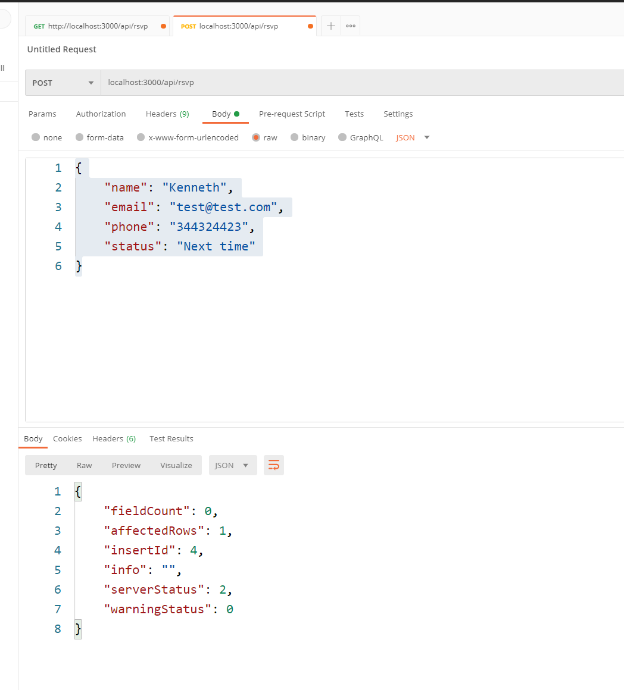

## Workshop Day 21

1. Create a birthday database

```
CREATE SCHEMA `birthday` DEFAULT CHARACTER SET utf8 ;
```

2. Switch to the birthday database

```
use birthday
```

3. Create the RSVP table

```
CREATE TABLE `birthday`.`rsvp` (
  `id` INT NOT NULL AUTO_INCREMENT,
  `name` VARCHAR(100) NOT NULL,
  `email` VARCHAR(45) NOT NULL,
  `phone` VARCHAR(10) NOT NULL,
  `status` ENUM('Count me in!', 'Next time') NOT NULL,
  UNIQUE INDEX `id_UNIQUE` (`id` ASC) VISIBLE,
  PRIMARY KEY (`id`));
```

4. Add new column to the rsvp table

```
ALTER TABLE `birthday`.`rsvp` 
ADD COLUMN `createdDt` DATETIME NOT NULL AFTER `status`,
ADD COLUMN `createdBy` INT NOT NULL AFTER `createdDt`,
ADD COLUMN `updatedDt` DATETIME NULL AFTER `createdBy`,
ADD COLUMN `updatedBy` INT NULL AFTER `updatedDt`;
```

5. Install Mysql driver for node JS

```
npm i mysql --save
```

6. Install dotEnv for environment variable management
```
npm i dotenv --save
```

7. Install app server middleware

```
npm i express body-parser --save
```

8. Install secure env locally and generate the secure .env

```
npm install secure-env
npx secure-env -s itssecret
```

9. Insert into the rsvp table

```
insert into `birthday`.`rsvp` (`name`, `email`, `phone`, `status`, `createdBy`, `createdDt`) values ('Kenneth Phang', 'test@test.com', '7552525', 'Next time', '2', '2008-07-04 00:00:00');

```


```
insert into `birthday`.`rsvp` (`name`, `email`, `phone`, `status`, `createdBy`, `createdDt`) values ('Kenneth Low', 'test@test.com', '7552525', 'Next time', '2', '2008-07-04 00:00:00');

```


```
insert into `birthday`.`rsvp` (`name`, `email`, `phone`, `status`, `createdBy`, `createdDt`) values ('Kenneth Tan', 'test@test.com', '7552525', 'Count me in!', '2', '2008-07-04 00:00:00');

```

10. Start Angular App

```
ng serve --poll=2000 --hmr
```




## Workshop Day 22

1. Download the northwind sql

2. Login as root (admin) execute the northwind.sql

3. Create a new user and grant all permission to the newly created user

```
CREATE USER 'workshopday22'@'localhost' IDENTIFIED BY 'password1234';

GRANT ALL ON northwind.* TO 'workshopday22'@'localhost';
```

4. Logout from root and relogin with the new user on your workbench

5. Create the sql statement

```
SELECT o.id, 
o.order_date, 
o.customer_id,
SUM(od.quantity) as total_quantity,
SUM(od.quantity * od.unit_price) as total_price,
SUM(od.quantity * od.discount) as total_discount,
SUM(od.quantity * p.standard_cost) as total_cost
FROM order_details od
JOIN orders AS o on o.id = od.order_id
JOIN products AS p on p.id = od.product_id
GROUP BY o.id
```

6. Construct the sql view
```
drop view compute_orders;
```

```
create view compute_orders as
  SELECT o.id, 
    o.order_date, 
    o.customer_id,
    SUM(od.quantity) as total_quantity,
    SUM(od.quantity * od.unit_price) as total_price,
    SUM(od.quantity * od.discount) as total_discount,
    SUM(od.quantity * p.standard_cost) as total_cost
    FROM order_details od
    JOIN orders AS o on o.id = od.order_id
    JOIN products AS p on p.id = od.product_id
    GROUP BY o.id
```

## Workshop Day 23

## Workshop Day 24

## Workshop Day 25
